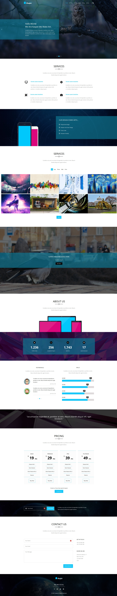

# Kasper | HTML&CSS Template

This template is part of a challenge/tutorial from a YouTube channel. It is based on a free PSD template made by Graphberry.

You can view and download through [Kasper - One Page Creative PSD Template](https://www.graphberry.com/item/kasper-one-page-psd-template).

## Video Tutorial: [Elzero Web School](https://www.youtube.com/playlist?list=PLDoPjvoNmBAy1l-2A21ng3gxEyocruT0t)

You can view the video tutorial on [YouTube](https://www.youtube.com/playlist?list=PLDoPjvoNmBAzHSjcR-HnW9tnxyuye8KbF).

## Live Preview

You can view a live preview of this template on [Kasper](https://ahmedmohamedabdelaty.github.io/Kasper-HTML-CSS-Template/).

